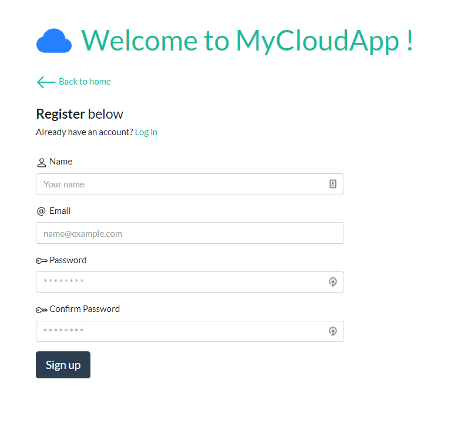

# cloud-app

My final project for system administration: A DIY private cloud to storage files such as a NAS software, for a home or office LAN.




## Configuration

Clone the repository code and change directory to the project folder:
```bash
# Execute in the directory where you wanna place the project
	git clone https://github.com/dawichi/cloud-app.git
	cd cloud-app
```

Create an account on [mLab](http://mlab.com) and add your `MONGO URI` in `config/keys.js` to connect to MongoDB. (Or use another MongoDB provider)

```javascript
// config/keys.js
module.exports = {
  mongoURI: "YOUR_MONGO_URI_HERE",
  secretOrKey: "secret"
}
```


## On development:

Install the missed dependencies for the server and client:
```bash
# In the project folder: cloud-app/
# Both can take a while depending of your network conection
	npm i    # install server dependencies
	cd ..
	
	cd client
	npm i    # install client dependencies
	cd ..
```


#### Dev - Backend

On the main directory you will find a `/sample.env` file. Follow the instructions there to configure the `MYCLOUDAPP_STORAGE`. After that, execute the following for start the backend server:

```bash
npm run server
# Server will be running on http://localhost:5000
```


#### Dev - Frontend

On `/client`directory you will find a `/sample.env` file. Follow the instructions there to configure the `REACT_APP_API_URL`. After that, being in the `/client` directory, execute the following for start the frontend:

```bash
npm start
# Server will be running on http://localhost:3000
```

***Development setup is ready!***

---


## For production:

To build MyCloudApp for production, follow this instructions:


#### Prod - Backend

On main directory you will find a `/sample.env` file. Follow the instructions there to configure the `HOME_CLOUD_STORAGE`. After that, execute the following for start the backend server:

```bash
npm start    # executes backend on normal mode
```


#### Prod - Frontend

On `/client`directory you will find a `/sample.env` file. Follow the instructions there to configure the `REACT_APP_API_URL`. After that, being in the `/client` directory, execute the following for start the frontend server:

```bash
# First, install serve (https://www.npmjs.com/package/serve) 
	npm i -g serve

# Then build the React app
	npm run build	# or 'yarn build'
	
# And finally execute the server
	serve -s build -l 3000 
```


---

### About 

This project is a MERN app, wich uses the following technologies:

- [MongoDB](https://www.mongodb.com/) for the database
- [Express](http://expressjs.com/) and [Node](https://nodejs.org/en/) for backend
- [React](https://reactjs.org) and [React Router](https://reacttraining.com/react-router/) for frontend
- [Redux](https://redux.js.org/basics/usagewithreact) for state management between React components


♥ Thanks for reading